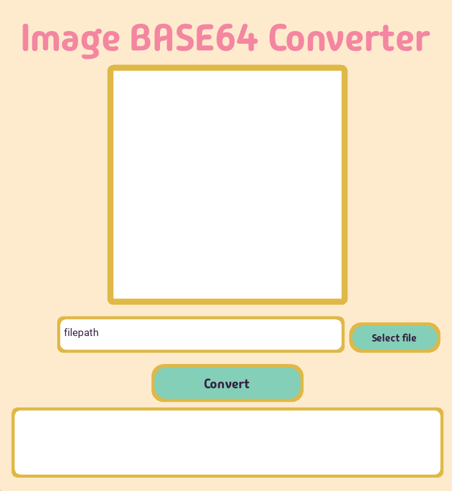

# Base64 Image Converter

A user-friendly desktop application built with Kivy that converts images to Base64 format.

## Features

- Modern UI with smooth animations and rounded corners
- File selection dialog for easy image picking
- Support for JPG and PNG image formats
- Real-time image preview
- Copy-friendly Base64 output
- Custom theme with pleasant color scheme

## Requirements

- Python 3.x
- Kivy 2.3.0
- Pillow
- NumPy
- (pyinstaller) *to create an .exe if desired*

## Installation

1. Clone the repository
2. Install dependencies:
```bash
pip install kivy pillow numpy
```

## Usage

1. Run the application:
```bash
python base.py
```

2. Click "Select file" to choose an image
3. Preview your selected image
4. Click "Convert" to generate the Base64 string
5. The Base64 output appears in the bottom text field

## Styling

The application features a custom design with:
- Soft drop shadows
- Rounded corners
- Animated buttons
- Custom font (https://befonts.com/madimi-font.html)
- Pastel color scheme

## Technical Details

- Window size: 600x650 pixels
- Supported formats: .jpg, .png
- Base64 encoding: UTF-8

## Project Structure

- `base.py` - Main application logic
- `base.kv` - Kivy UI layout and styling
- `madimione-regular.otf` - Custom font file
- `packeger.py` - Easy method to make it into a .exe

## Contributing

Feel free to submit issues, fork the repository, and create pull requests for any improvements.
